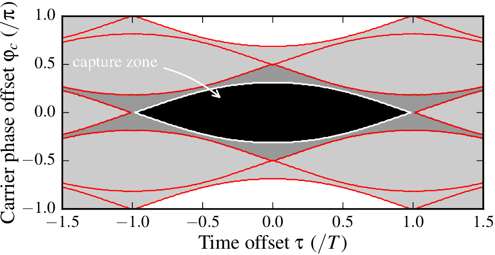
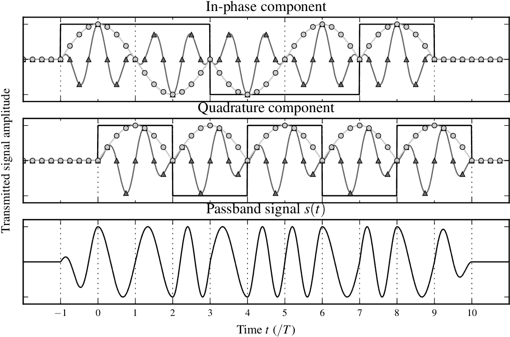

Packet Collisions in 802.15.4 Networks
=========

Simulation code for the analysis of concurrent transmission in IEEE 802.15.4 wireless networks. 
This is the accompanying code to the technical report available at [ArXiv](http://arxiv.org/abs/1309.4978); the full paper appeared at the IEEE Transactions on Wireless Communications ([On the Reception of Concurrent Transmissions in Wireless Sensor Networks](http://dx.doi.org/10.1109/TWC.2014.2349896)).

##Directories
- src: Python code for calculating the demodulator output of the receiver
- figs: matplotlib code used to generate some of the figures in the paper, to see how to use phitau.py
- collision-viz: re-implementation of the simulation code in JavaScript and the visualization applet code

###Dependencies
For the src/figs part, you need a matplotlib installation that supports TeX output (see the [matplotlib help page](http://matplotlib.org/users/usetex.html))

###Example Outputs
####BER Contour Plot

####MSK Waveform Plot

